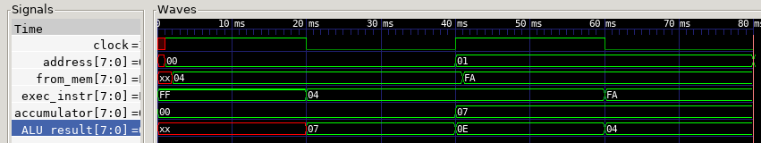
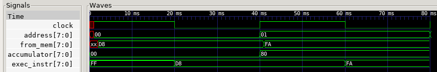
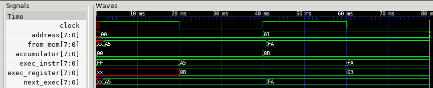
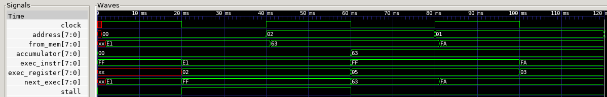
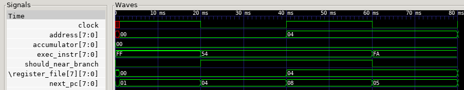
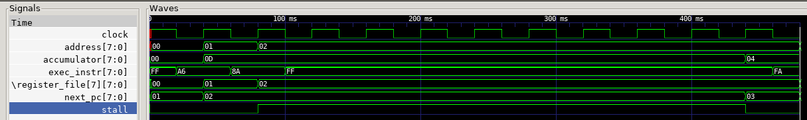

# Report on the Design and Implementation of an 8-Bit Computer in Verilog
Designed by Charles Van West throughout Spring '22.

# Instruction Set Architecture
The first task for this computer was the design of the ISA. Since I did not
want overly complex control logic, I created something as close to a MISC
architecture as possible.

## General Choices
Instructions are 8 bits long, so as to be loadable in a single cycle. Unlike
the 4004, which heavily inspired this computer, there are no two-byte
instructions for simplicity. Opcodes usually take up 4 or 5 bits, depending on
the instruction; the rest is reserved for a register specification or an
immediate. Since space within an instruction is highly constrained, this
computer uses an accumulator as both an argument and target register for most
instructions.

TODO: maybe split instructions in half: have one-byte and two-byte versions
depending on whether an immediate is necessary. That probably isn't too
complicated.

## Registers
There are 8 registers, so as to fit register specifications into 3 bits each.
Register 7 (`R7`) is also used as the program counter.

## Memory Model
This computer is 8-bit addressed and byte-addressable. This allows only 256
bytes of addressable memory, but, given that it is a computer made fro the
purpose of learning about computer architecture, that should be enough.

Instruction and data memory are stored in the same bank (von Neumann
architecture). The text segment starts at address `0x0` and grows to greater
addresses. The data segment (really just a stack, for this simple machine)
starts at 0xFF and grows to lesser addresses. This is not really enforced,
though.

## Instructions in Detail
There are about 4 instruction formats, along with a few miscellaneous
special-case instructions. This is not as simple as I would have liked, but
there are not that many bits per instruction, so this seemed the most efficient
use of program space. The instructions (in their respective categories) are
described in the following sections.

### ALU Instructions
Note that this is not called "arithmetic instructions," as multiplication and
division are not ALU operations.

| Name | Format | Example | Description |
| --- | --- | --- | --- |
| (general) | `00 SSS RRR/III` | (see below) | Perform ALU operation SSS on register `RRR`/immediate `III` and the accumulator. |
| `ADD` | `00 000 RRR` | `ADD R1` | Add register `RRR` to the accumulator. |
| `SUB` | `00 001 RRR` | `SUB R3` | Subtract register `RRR` from the accumulator. |
| `AND` | `00 010 RRR` | `AND R6` | Bitwise-AND the accumulator with register `RRR`. |
| `OR` | `00 011 RRR` | `OR R5` | Bitwise-OR the accumulator with register `RRR`. |
| `LSL` | `00 100 CCC` | `LSL #3` | Shift the accumulator left by `CCC` bits. |
| `LSR` | `00 101 CCC` | `LSR #5` | Shift the accumulator right by `CCC` bits. |
| `NOT` | `00 110 XXX` | `NOT` | Bitwise-negate the accumulator. |
| `XOR` | `00 111 RRR` | `XOR R3` | Bitwise-XOR the accumulator with register `RRR`. |

### Special Arithmetic Instructions
Multiply and divide both require specialized hardware, and thus are not ALU
instructions. Note that division requires multiple cycles to complete and
*will* cause a processor stall until finished.

| Name | Format | Example | Description |
| --- | --- | --- | --- |
| (general) | `1000 1 RRR` | (see below) | Perform special arithmetic operation `S` on register `RRR` and the accumulator. |
| `MUL` | `1000 0 RRR` | `MUL R0` | Multiply the accumulator by register `RRR` (unsigned). |
| `DIV` | `1000 1 RRR` | `DIV R2` | Divide the accumulator by register `RRR` (unsigned). |

### Branch Instructions
Branches with a four-bit immediate `CCCC`, are PC-relative, and the branch
constant is sign-extended to allow branching backwards. The `BA` and `BR`
instructions would be the ones used to implement function calls, and due to
their structure could be used to implement two-function coroutines reasonably
well.

| Name | Format | Example | Description |
| --- | --- | --- | --- |
| (general) | `01 SS CCCC` | (see below) | Perform branch type `SS` to `R7 + CCCC`. |
| `B` | `01 00 CCCC` | `B label` | Unconditionally branch to `R7 + CCCC`. |
| `BZ` | `01 01 CCCC` | `BZ label` | Branch to `R7 + CCCC` if the accumulator is zero. |
| `BNN` | `01 10 CCCC` | `BNN label` | Branch to `R7 + CCCC` if the accumulator is nonnegative. |
| `BA` | `01 11 0RRR` | `BA R2` | Branch to the accumulator and leave a return address in register `RRR`. |
| `BR` | `01 11 1RRR` | `BR R4` | Branch to register `RRR` and overwrite it with a return address. |

### Memory-Transfer Instructions
Not too much to say about these aside from their descriptions.

| Name | Format | Example | Description |
| --- | --- | --- | --- |
| (general) | `1110 S RRR` | (see below) | Perform memory operation `S` using register `RRR` as an argument. |
| `LD` | `1110 0 RRR` | `LD [R1]` | Load the data at the address contained in register `RRR` into the accumulator. |
| `ST` | `1110 1 RRR` | `ST [R1]` | Store the data in the accumulator to the address contained in register `RRR`. |

### Set Instructions
A small category, but there *are* two of them.

| Name | Format | Example | Description |
| --- | --- | --- | --- |
| `SEL` | `1100 CCCC` | `SEL #13` | Set the lower 4 bits of the accumulator to `CCCC`. |
| `SEH` | `1101 CCCC` | `SEH #0` | Set the upper 4 bits of the accumulator to `CCCC`. |

### Miscellaneous Instructions
There are a few other operations this computer performs which aren't covered by
the above categories, and are thus presented below. Note that instructions
beginning with `1111` are special cases and do not take any arguments.

| Name | Format | Example | Description |
| --- | --- | --- | --- |
| `ADI` | `1001 CCCC` | `ADI #-1` | Add the immediate `CCCC` (sign-extended) to the accumulator. |
| `MOV` | `1010 D RRR` | `MOV >R0` | If `D` is set, move the accumulator into register `RRR`. Else, do the reverse. |
| `WR` | `1111 0000` | `WR` | "Write" the value of the accumulator (really just calls `$display`). |
| `HLT` | `1111 1010` | `HLT` | Halt the processor (really just calls `$finish`). |
| `NO` | `1111 1111` | `NO` | No-op. |

Any instruction not listed above is considered an illegal instruction and may
have exciting consequences when executed.

## ALU Specifications
Since I was able to design the ALU as well, I did so with the ISA in mind. The
ALU has a 3-bit select input (`S`), two 8-bit numerical inputs (`A` and `B`),
one 8-bit output (`D`), and one carry output (`C`, currently unused). The
available operations are described in the following table.

| Select | Operation | Description |
| --- | --- | --- |
| `000` | `D = A + B` | Add `A` and `B`. |
| `001` | `D = A - B` | Subtract `B` from `A`. |
| `010` | `D = A & B` | Bitwise-AND `A` and `B`. |
| `011` | `D = A \| B` | Bitwise-OR `A` and `B`. |
| `100` | `D = A << B` | Shift `A` left by `B`. |
| `101` | `D = A >> B` | Shift `A` right by `B`. |
| `110` | `D = ~A` | Bitwise-negate `A`. |
| `111` | `D = A ^ B` | Bitwise-XOR `A` and `B`. |

The NOT and XOR operations were swapped in the original specification, but I
realized that arranging them this way would make for simpler ALU logic (see
below).

# ALU Internals
The ALU, as per the specification above, supports 8 operations. The internal
structure of the ALU consists of 8 separate logic circuits (one for each
operation), feeding into an 8-way 8-bit multiplexer. A few of the operations
are reused across selections; see below for details.

## Addition
Addition uses an 8-bit ripple-carry adder. This is a small computer, and so the
ripple time from one end of the adder to the other is not significant.

## Subtraction
Subtraction uses an 8-bit ripple-carry adder, along with a specialized
two's-complement adder which only performs a bit-negation-plus-1 operation.
This is implemented as an extra adder hardwired to a bit-negated version of the
second ALU input with a carry input of 1, whose output is multiplexed with the
second input to the adder used for addition.

Note: in actual hardware, this could be implemented using mostly half-adders
rather than full-adders to save transistors, as there is no real "second
input."

## Logical Operations
Since the bitwise logical operators work, well, bit-by-bit, their circuits use
direct combinational logic with the input and select bits to cut down on the
number of multiplexers necessary. As each bit of the input behaves the same way
with respect to its corresponding output bit, the following Karnaugh map fully
characterizes the input-output logic.

```
                 A B
           00  01  11  10
        00  0 | 0 | 1 | 0
           ---|---|---|---
        01  0 | 1 | 1 | 1
S2 S0      ---|---|---|---
        11  0 | 1 | 0 | 1
           ---|---|---|---
        10  1 | 1 | 0 | 0
```

One solution to this map is `S0(A ^ B) + ~S2(AB) + S2(~S0)(~A)`, which
is the per-bit logic used by this computer.

## Bit-Shifts
Since this is not a digital logic design course, I used the first circuit I
thought of: one logic line per possible position (of which there are 8), ANDed
with the right bits, all ORed together at the output. Also, because I am lazy,
I only built explicit left-shift logic, which is used with the input and output
bits swapped end-for-end for right shifts.

# Pipelining
This computer was originally implemented as a single-cycle machine. Pipelining
an accumulator-based machine seemed impossible at first, as every instruction
would potentially constitute a data hazard due to the accumulator being
accessed on every instruction. After a few deep breaths, I decided to tackle
each instruction class in turn to see whether anything could be done.

## Stages and Model
### Instruction Fetch
**Rising-edge**: the instruction memory address register is assigned the value
of the program counter, and the memory clock is set high.

**Falling-edge**: if not stalled for a load-store operation or divide, the
result of the memory access is read into the `exec_instr` register, the value
of the register specified by the instruction's argument is read into the
`exec_register` register, the memory clock is set low, and the program counter
is incremented.

### Instruction Execute
**Rising-edge**: the accumulator is assigned its new value, depending on the
value of `exec_instr`, and the target register is written (if applicable). If
stalled for a divide, the completeness of the operation is checked and the
appropriate registers are updated.

**Falling-edge**: If stalled for a load-store instruction, the result of the
memory access is read into the accumulator (for loads), and the stall register
is reset.

## ALU Instructions
ALU operations pipeline pretty easily, as it happens: the accumulator is simply
provided as an ALU argument and assigned the value of the ALU output in the
same cycle, which produces the right result by the falling clock edge. Since
there's no memory access, no other control logic is necessary.

## `SET` and `MOV`
`SET`'s implementation is even simpler than the ALU instructions, as it has no
memory access needs. `MOV`, however, has the capability to write to registers
as well as read them, causing a potential data hazard if the same register is
read immediately after it is written. I avoided calamity by resolving register
writes on the leading clock edge and register reads for the *next* instruction
on the falling clock edge, which ensures that all registers are in the correct
state before they are requested again.

Note that there is one exception to this, but it makes for more logical
operation: `R7`, the program counter, *is* incremented on a falling clock edge;
however, this means that reads of `R7` will return the address *of the
instruction doing the read*, not the instruction after it, and *writes* to `R7`
will cause the program counter to go to the instruction *after* the given
address. This makes for a rather simple, though slightly dumb, way to implement
subroutines.

## `LD` and `ST`
Since this computer uses single-port memory, load and store operations both
have to stall the processor for one cycle and take over memory access. I
handled this by including a `stall_for_load_store` register, incrementing the
program counter only if the processor was not stalled, and loading a no-op into
`exec_instr` while stalled. Fortunately, this is only a one-cycle pipeline
bubble, and so the control logic is not terribly complex:
`stall_for_load_store` is simply set to zero on the next falling clock edge.

## `B`, `BZ`, and `BNN`
As it turns out, this architecture permits no-delay branching! Since
next-instruction loads are set up at the same time as instruction execution,
the address of the next instruction to load is just `PC + [branch offset] +
[advance if not stalled]`, which may just be assigned to `address` and the
program counter. Very convenient.

## `MUL` and `DIV`
`MUL` is as simple as an ALU instruction; it just has an extra switch to use
dedicated multiplication hardware.

`DIV` might be the most complex instruction. When a divide occurs, the
processor is stalled with `stall_for_div` set and no-ops are executed until
`div_complete` indicates that the result of the division is ready to be read
into the accumulator. Once that happens, execution resumes as usual.

# Gate-Leveling
The goal for this computer was to implement it in mostly gate-level Verilog. A
few tricks to get this working properly merit some mention.

## Near-Branches
Near-branch calculations are done with an eight-bit adder only, using all three
inputs: one numeric input each for the program counter and the branch jump
quantity, and one carry input used instead for a conditional one-byte advance.
Since instructions are only one byte long, this is possible and saves some
multiplexers.

This was surprisingly difficult to get right; getting the pipeline to load one
instruction ahead of the current one while still having the program counter in
an expected position took some thinking. The end solution for it can be found
in the code, but it was *not* obvious how to get there.

As it stands, `next_pc` holds the next value of the program counter based on
the current counter and whether we're about to branch. That means it has to
know the result of an upcoming branch, that branch's offset, *and* whether we
have to stall for a load/store; this was accomplished by using both carry-in
and the usual 8-bit addends for a single adder.

The good news is that, once `next_pc` is set up, it can also be used for the
next value of `address`, as we want to read that instruction into memory next.
This makes for a pretty compact implementation in hardware.

## Register Branches
These were surprisingly easy to implement, and were done *after* gate-leveling
and pipelining---I simply multiplexed `next_pc` with either the near-branch or
the register-branch target, and multiplexed the register-file write to save the
"return" address. To make this easier, I split `next_pc` into always-near and
always-register calculations; the value the program counter *would* have taken
if a register branch weren't about to occur is the one saved in the register in
question.

# Register Initialization
For my convenience writing this computer, I set the first six registers to one
and the first six prime numbers; given how small this computer is, that might
actually be an efficiency-gaining move in hardware, too.

# Assembler
Since I didn't feel like hand-assembling every damn instruction (and wanted an
excuse to polish my rusty Perl skills), I decided to write an assembler for
this project. Invocation is as follows:
```
./assembler.pl <input file> [output file]
```
When invoked with an output file, the assembler will convert the input file
into binary machine code and write it out. When invoked without an output file,
the assembler will print a pretty representation of the program in both machine
code and text to standard output.

Since this project is mainly focused on the computer-architecture side of
things, the assembler *does virtually no grammar checking*. If you write
programs in the same format as my example code and follow the grammar laid out
above, things will work fine, but do *not* expect it to catch your errors very
intelligently, or at all!

## Static Data
This processor does not distinguish between data and text segments because the
available program size is so damn small. If static data is necessary, the
assembler allows arbitrary decimal constants to be specified at given locations
by writing *only* an immediate at some location in the code. For example, the
following would create a constant addressable by using `ADDR constant` (see
next section):
```
constant:
	#127
```

## The `ADDR` Instruction
The assembler provides one instruction which the machine does not, called
`ADDR`, which takes a label as an argument. It's used to load the address of a
label into the accumulator, and aliases to a `SEL`/`SEH` pairing in machine
code. This was included to allow loading static data, addresses, or function
labels easily.

# Exposition

In case you *really* want to know what's going on inside.

## Architecture Diagram

## Timing Diagrams
You said to do separate diagrams for the single-cycle and pipelined
implementations---but, due to the simplicity of the pipeline, I decided it made
more sense to just show the pipelined version. They're not enormously
different.

### Single-Register Arithmetic Operations ("a-type")

The following diagram shows the result of running
```
ADD R4
HLT
```
on the processor:



At 0 ms, the clock goes high for the first time, address zero is loaded from
memory, and the first instruction (`NO`) does its (nonexistent) register
write---showing the two pipeline stages, load and execute, both operating at
the same time. The accumulator remains at its initial value of zero.

At 20 ms, the pipeline is advanced, and the loaded instruction (`04`, or `ADD
R4`) is copied into `exec_instr`, at which point the ALU (hardwired to respond
to `exec_instr`) starts setting up its output.

At 40 ms, `ADD R4` is executed, setting the accumulator to 7 (as `R4` contained
7 initially), and the next instruction (`FA`, or `HLT`), is loaded from memory.

At 60 ms, the pipeline is advanced again, and `HLT` is copied into
`exec_instr`, in preparation for its execution at 80 ms.

### Single-Immediate Operations ("i-type")

The following diagram shows the result of running
```
SEH #8
HLT
```
on the processor:



Like before, the instruction is loaded on the first pulse and executed on the
next, but *this* time the ALU has nothing to do with things, as it's a `SEH`
operation: the lower four bits of the instruction are simply copied to the
upper four bits of the accumulator at 40 ms.

### Move Operations ("m-type")

If we run
```
MOV <R5
HLT
```
we'll actually have to use the `exec_register` register, which is set on a
falling edge to whatever register needs to be read for the next instruction.



The register file is written on the rising edge and read on the falling edge,
based on the value of `next_exec` (which is set conditionally depending on what
will be executed in the next cycle). At 20 ms, this means that `R7` is read
into `exec_register` in preparation for the execution of `A5`/`MOV <R5` on the
next rising edge---and the accumulator is duly set to the value of
`exec_register` at 40 ms.

### Load-Store Operations ("h-type," for "heap-referencing")

Running
```
LD [R1]
HLT
#99
```
will attempt to load 99 into the accumulator, and in doing so will require a
pipeline stall.



The first instruction, `E1`/`LD [R1]` is loaded and copied into `exec_register`
as usual, but `LD` instructions have to hijack the datapath to load a specified
value from memory. Note that `next_exec` becomes `FF`/`NO` at 20 ms and `stall`
goes high, which will cause a no-op to be executed---which is good, because
otherwise the processor would attempt to execute the value that `LD` just
fetched from memory. After the accumulator is safely set to the loaded value at
60 ms, `stall` goes low, allowing the program counter to advance and the usual
instruction-load stage to execute again at 80 ms.

`ST` also requires a stall, but only for the fact that it hijacks `address` in
order to do its write---otherwise, `address` would be used for instruction
loading.

### Near and Far Branching ("b-type" or "j-type," depending on persuasion)

The program
```
BZ end
NO
NO
NO
end: HLT
```
does not require a stall! It's just a little odd to look at.



Since the accumulator is fully set up on a falling edge, `should_near_branch`
(whether we're doing a short-jump branch on the next cycle) can figure out
whether a branch is about to occur pretty easily, as branching conditions
depend *only* on the value of the accumulator. At 20 ms, the accumulator is
zero, and thus it goes high, telling `next_pc` to add the value of the branch
immediate (in this case, 3) to the current value of the program counter and use
that as the next instruction load address. When the branch is executed at 40
ms, `address` and `PC`/`register_file[7]` are set appropriately, and the next
load cycle at 60 ms loads the final `HLT`.

Far branching is simply another input to the `next_pc` multiplexer, taking the
current value of the accumulator or one of the registers instead of the program
counter and an offset; the actual timing is the same.

### Division (because it's painful)

I won't go into detail, but here's what
```
MOV <R6
DIV R2
HLT
```
looks like:



Once the processor knows it's about to do a division, `stall` goes high, and
stays high until the division is finished, preventing the program counter from
advancing and loading no-ops into `exec_instr`. Once the divide finishes, the
result is copied to the accumulator and processing resumes as usual.

# Sources
- *Computer Organization and Design: The Hardware/Software Interface, ARM®
  Edition*, David A. Patterson & John L. Hennesey
- *Verilog by Example: A Concise Introduction for FPGA Design*, Blaine Readler
- Intel 4004 datasheet:
  http://datasheets.chipdb.org/Intel/MCS-4/datashts/intel-4004.pdf
